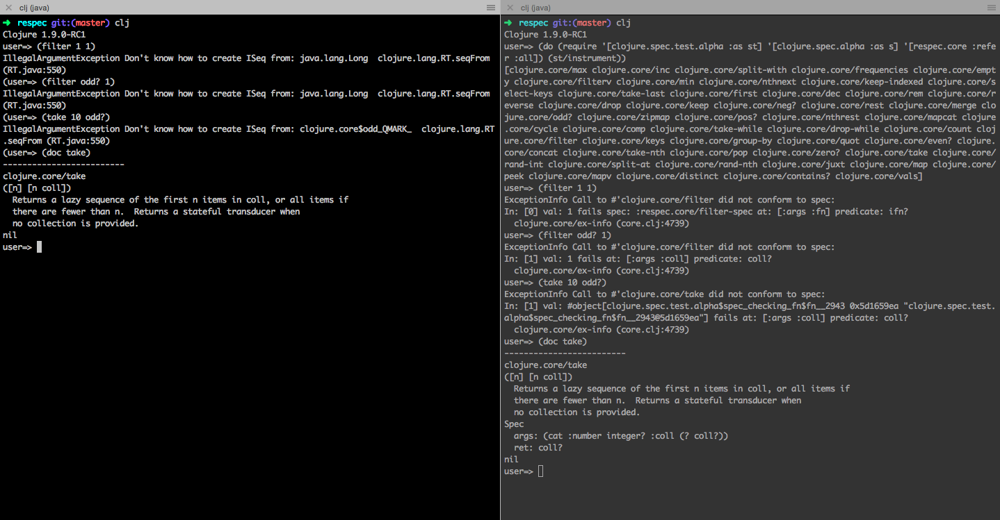

# respec 

A collection of specs for clojure core functions

## Motivation

This is a collection specs I wrote as a learning exercise to learn spec and also to learn more about clojure.core functions. [This](https://www.reddit.com/r/Clojure/comments/778tc2//dok9akv/) Reddit comment is the core inspiration for the repo. [Expound](https://github.com/bhb/expound) is also a cool library for error messages.

# Stability warning

As per [comment](https://www.reddit.com/r/Clojure/comments/7drqyi/respec_a_collection_of_specs_for_clojurecore/dq0e91i/) from Alex Miller **many of the specs are not correct**. This is purely a learning exercise as a beginner and also to experiment with better error messages for core functions with spec. Please use it at your own risk and it's an experiment to see how specs can be written for core functions. I might be missing a lot of edge cases, arities related to transducers, etc. There are [efforts](https://www.reddit.com/r/Clojure/comments/778tc2/is_clojure_19_improving_error_messages/dolil1v/) undertaken by the core team to solve this and I am very much looking forward to.

## Installation

I haven't included it in Clojars since I don't know if there are better efforts to spec clojure.core functions to provide more friendly error messages.

* git clone https://github.com/tirkarthi/respec
* cd respec
* lein do pom, jar, install

## Better error messages and spec at docs

## Contributions

Please refer to [CONTRIBUTING.md](CONTRIBUTING.md)

## License

Copyright © 2017 Karthikeyan S

Distributed under the Eclipse Public License either version 1.0 or (at your option) any later version.
